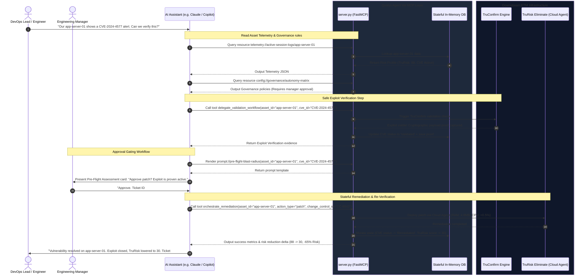

# Agent Val MCP Server

An industry-standard **Model Context Protocol (MCP) Server** that exposes **Qualys Enterprise Threat Management (ETM)** services to conversational AI agents. Built with the official Python `FastMCP` framework, the server acts as an intelligent middleware bridge, translating natural language requests into safe, stateful validation and remediation workflows.

This repository implements **Horizon 1 (The Minimum Viable Orchestrator)** and features a fully persistent **Stateful In-Memory Sandbox** engine, enabling immediate demonstration of closed-loop vulnerability identification, exploit verification (TruConfirm), and remediation validation (TruRisk Eliminate).

> 🛡️ **See it before you install anything.** Open **[`demo/security-sentinel-demo.html`](demo/security-sentinel-demo.html)** in any browser — no Python, no `pip install`, no MCP client. It's a pixel-faithful, fully self-contained recreation of the real dashboard and chat UI, with `delegate_validation_workflow` and `orchestrate_remediation` simulated client-side using the exact same odds and risk-score formula as `server.py`. Click through the whole validate → approve → remediate loop in under a minute. Details in [Try the Offline Demo](#-try-the-offline-demo) below.

---

## 🏗️ System Architecture & Workflow

The diagram below details the end-to-end sequence showing how the AI Assistant collaborates with the Agent Val MCP Server to identify, validate, approve, and remediate a live vulnerability within standard communication pipelines:



---

## 🛠️ Implemented Primitives

The server registers three types of Model Context Protocol primitives with the client:

### 1. MCP Resources (Read-Only Data Context)
* **`telemetry://active-session-logs/{asset_id}`**: Retrieves real-time security posture, current TruRisk score (0-100), host metadata (IP, OS, Environment), and active vulnerabilities. If the asset does not exist, the server dynamically generates a realistic telemetry profile.
* **`config://governance/autonomy-matrix`**: Exposes central security policies loaded dynamically from a local `governance_matrix.json` file. It specifies permitted remediation actions, maintenance windows, and manual approval triggers.

### 2. MCP Tools (Action Capabilities)
* **`delegate_validation_workflow(asset_id: str, cve_id: str)`**: Invokes **TruConfirm** to perform a safe, non-destructive cryptographic check. Returns an exploit verification response containing HTTP payloads or execution proof, mutating the in-memory vulnerability state to `Validated`.
* **`orchestrate_remediation(asset_id: str, action_type: str, change_control_id: str)`**: Performs stateful remediation via the **Qualys Cloud Agent** (supporting `patch`, `mitigate_config`, or `network_isolate`).
  * **Stateful Mutator**: This tool alters the in-memory registry. It marks the target asset's vulnerabilities as `Remediated`, updates remediation statuses to `Success`, and dynamically recalculates and lowers the host's `trurisk_score` (reducing it by ~65%).

### 3. MCP Prompts (Collaboration Templates)
* **`prompt://pre-flight-blast-radius`**: Generates a pre-flight assessment prompt instructing the AI assistant to summarize the threat, evaluate governance guidelines, check the maintenance window, and request formal Engineering Manager approval in chat.

---

## 🖥️ Try the Offline Demo

Before you clone, create a venv, and wire up Claude Desktop — **[`demo/security-sentinel-demo.html`](demo/security-sentinel-demo.html)** lets you click through the entire closed loop this server implements, right now, in a browser tab.

```bash
# no build, no install, no server — just open it
open demo/security-sentinel-demo.html          # macOS
# or: xdg-open demo/security-sentinel-demo.html # Linux
# or: start demo/security-sentinel-demo.html    # Windows
```

It reproduces the real `agent_backend.py` + `static/` web GUI from this repo, screen for screen:

- **Landing splash** — choose the Visual Diagnostic Grid or the Conversational Chat, exactly like the real app
- **Telemetry cards** for `app-server-01`, `db-host-05`, and `dev-box-09`, seeded with the same TruRisk scores and CVEs as `server.py`'s `MOCK_ASSET_REGISTRY`
- **Validate Exploit** — runs the same probability the real tool does (85% verified for Production hosts, 50% for Development), and shows the matching `TruConfirm` evidence template either way
- **The HITL approval modal** — blast-radius assessment, change-ticket field, Approve/Decline — gated exactly like `pre_flight_blast_radius`
- **Authorize Patch Execution** — recalculates TruRisk with the real formula (`max(15, score × 0.35)`) and reflects it live in both the dashboard and chat sidebar
- A live **AI Agent Thought Stream** console logging every simulated `resources/read` and `tools/call`, in the same style as the real MCP traffic

It's a client-side simulation, not a live MCP connection — for the real thing, follow **Getting Started** below and connect via `mcp dev server.py` or Claude Desktop.

---

## 🚀 Getting Started

### Prerequisites
* Python 3.10 or higher
* [Git](https://git-scm.com/) installed

### Installation & Setup

1. **Clone & Navigate**:
   ```powershell
   git clone https://github.com/mayukhg/ai-agent-mcp.git
   cd ai-agent-mcp
   ```

2. **Create and Activate a Virtual Environment**:
   ```powershell
   python -m venv venv
   # On Windows:
   .\venv\Scripts\activate
   # On macOS/Linux:
   source venv/bin/activate
   ```

3. **Install Dependencies**:
   ```powershell
   pip install -r requirements.txt
   ```

4. **Environment Configuration**:
   Create a `.env` file from the provided template:
   ```powershell
   copy .env.example .env
   ```
   *By default, the server runs in stateful `mock` mode. To point to live APIs in the future, toggle `QUALYS_API_MODE=live` and configure your API tokens.*

---

## 🔍 Local Verification and Testing

You can easily verify the server's protocol compliance and test its stateful transitions using the MCP developer utility:

1. **Verify Schema Compliance**:
   Run the following command to spin up the server in developer mode and view registered resources, tools, and prompts in an interactive web UI:
   ```powershell
   mcp dev server.py
   ```

2. **Run a Closed-Loop State Test**:
   You can run the server and trigger the tools using your terminal to see the stateful updates in action:
   
   * **Step A: Check Vulnerabilities**
     Inspect telemetry for `app-server-01` to observe the active exploit risk.
   * **Step B: Run Validation**
     Invoke `delegate_validation_workflow` on `app-server-01` for `CVE-2024-4577`. The status transitions to `Validated` and logs exploit execution logs.
   * **Step C: Execute Remediation**
     Run `orchestrate_remediation` with `action_type="patch"` and a mock change ID like `CC-9942`.
   * **Step D: Confirm Resolution**
     Query the telemetry resource again; the vulnerability is marked `Remediated` and the asset risk score is successfully reduced.

---

## 🤖 Integrating with Claude Desktop

To allow your Claude Desktop client to use the Agent Val ETM MCP Server, add the following snippet to your Claude configuration file:

* **File Path**: `%APPDATA%\Claude\claude_desktop_config.json`

```json
{
  "mcpServers": {
    "agent-val-mcp": {
      "command": "python",
      "args": [
        "C:\\Users\\maghosh\\.gemini\antigravity\\scratch\\ai-agent-mcp\\server.py"
      ],
      "env": {
        "QUALYS_API_MODE": "mock",
        "GOVERNANCE_MATRIX_PATH": "C:\\Users\\maghosh\\.gemini\\antigravity\\scratch\\ai-agent-mcp\\governance_matrix.json"
      }
    }
  }
}
```

*Note: Replace paths with absolute paths matching your local environment workspace. Make sure to restart Claude Desktop after editing.*