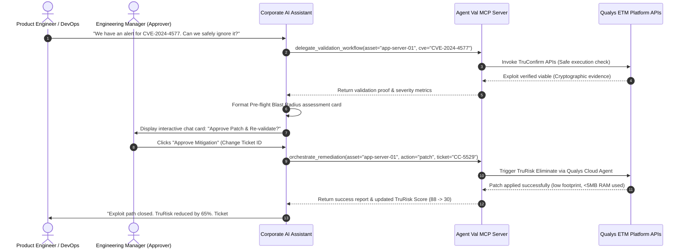
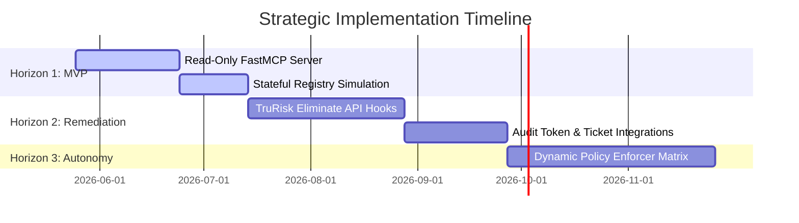

# Stakeholder Briefing: Agent Val MCP Server
## Extending Qualys ETM Capabilities to the AI-Agent Interface

---

## 1. Executive Summary: The Agentic Future of IT Operations

Enterprise AI agents are rapidly becoming the primary interface through which modern organizations execute operational workflows across DevOps, IT operations, and cybersecurity. As this shift accelerates, software products that expose their capabilities to these conversational AI interfaces will capture the next wave of enterprise consumption. Those that do not will become invisible.

The **Agent Val MCP (Model Context Protocol) Server** bridges this gap. By wrapping the core orchestration and execution logic of the **Qualys ETM (Enterprise Threat Management)** platform inside a standard, secure MCP interface, we enable corporate AI assistants (such as Microsoft Copilot Studio, Google Gemini, Anthropic Claude, and custom corporate Slack/Teams bots) to discover, validate, and remediate critical security vulnerabilities using natural language.

---

## 2. Stakeholder Value Propositions

### 🛡️ For the CISO & Security Operations Leaders
* **Shrinking MTTR from Weeks to Minutes**: Traditional vulnerability handovers are plagued by communication bottlenecks (tickets, asset ownership searches). The MCP Server closes the loop directly in collaboration spaces (Slack/Teams).
* **Immutable Policy Governance**: Security policies are exposed as read-only system configurations (`config://governance/autonomy-matrix`). The external AI agent is programmatically blocked from executing actions outside pre-approved maintenance windows or on critical assets without explicit manager sign-off.
* **Audit-Ready Actions**: Every patch or mitigation script executed by the agent requires and records a corporate change-control ticket ID, creating a seamless, compliant trail.

### ⚙️ For DevOps & Product Engineering Leaders
* **Zero Friction AppSec**: Decentralized project teams do not log into standalone security dashboards. The MCP server brings vulnerability discovery and remediation directly to their existing developer tools (Slack, Teams, and Command Line Interfaces).
* **Safe Validation with TruConfirm**: Developers can safely verify whether an exploit path is actively viable using safe, non-destructive cryptographic checks (`delegate_validation_workflow`), avoiding false-positive disputes.
* **Near-Zero Footprint Remediation**: Remediations are executed via the lightweight Qualys Cloud Agent, operating with less than 5MB of runtime memory and virtually zero idle CPU overhead, guaranteeing application uptime and SLA stability.

### 💼 For Business Executives & Sales Directors
* **Driving Core Platform Licensing**: The MCP server is a frictionless gateway that drives massive downstream Qualys consumption. Every validation check invokes a **TruConfirm** subscription, and every remediation executes via a paid **Qualys Cloud Agent** license and a **TruRisk Eliminate** seat.
* **Tapping the Decentralized Developer Budget**: AppSec and DevOps budgets are merging. Exposing Qualys ETM as a collaborative AI capability allows Qualys to monetize the millions of developers who own security execution but never purchase traditional SOC dashboard tools.

---

## 3. The End-to-End Operational Lifecycle

The diagram below illustrates how the Agent Val MCP Server coordinates the security lifecycle within an everyday team chat room, eliminating human latency at each step.

---

## 4. Strategic Implementation Roadmap

### 1️⃣ Horizon 1: The Minimum Viable Orchestrator (Months 1–3)
* **Goal**: Validate market demand and pipeline with zero backend changes.
* **Scope**: Build the read-only MCP server wrapper using FastMCP, exposing risk telemetry (`telemetry://active-session-logs/{asset_id}`), governance matrix resource (`config://`), and safe TruConfirm exploit checking tools (`delegate_validation_workflow`).
* **Effort**: Low risk, under 100 lines of standard Python, executing in regular feature sprints.

### 2️⃣ Horizon 2: Full Remediation Integration (Months 3–6)
* **Goal**: Enable safe, active remediation within the conversational workspace.
* **Scope**: Implement target tools for `orchestrate_remediation`, binding actions to active Qualys Cloud Agent footprints (Patch Management, Mitigate, and Network Isolation).

### 3️⃣ Horizon 3: Advanced Autonomy & Global Policy Sync (Months 6+)
* **Goal**: Run automated, hands-off patch pipelines.
* **Scope**: Integrate dynamic param filtering, enforcing strict governance boundaries and automated ticketing closures through native ETM synchronization.
